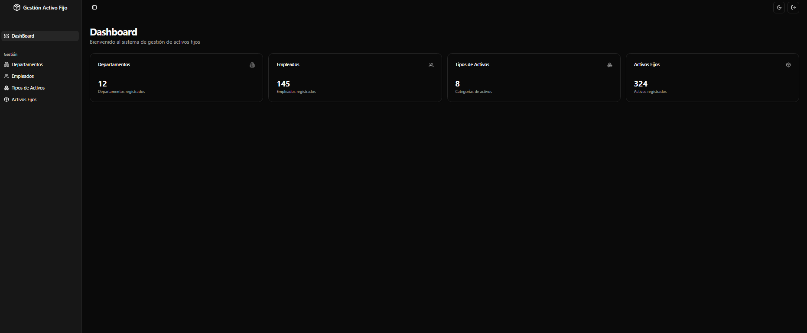

# 📌 Gestión de Activos



---

## 🏆 Insignias


---

## 📑 Índice

1. [Descripción del Proyecto](#-descripción-del-proyecto)
2. [Estado del Proyecto](#-estado-del-proyecto)
3. [Demostración de funciones y aplicaciones](#-demostración-de-funciones-y-aplicaciones)
4. [Acceso al Proyecto](#-acceso-al-proyecto)
5. [Tecnologías utilizadas](#-tecnologías-utilizadas)
6. [Personas Contribuyentes](#-personas-contribuyentes)
7. [Personas Desarrolladoras del Proyecto](#-personas-desarrolladoras-del-proyecto)
8. [Licencia](#-licencia)

---

## 📌 Descripción del Proyecto

El **Sistema de Gestión de Activos** es una plataforma diseñada para facilitar el seguimiento, control y administración de activos dentro de una organización. Permite la gestión eficiente de activos físicos y digitales, optimizando el uso de los recursos y asegurando su mantenimiento adecuado.

---

## 🚀 Estado del Proyecto

📌 **En Desarrollo**

Actualmente, el proyecto está en fase de desarrollo. Se están implementando las funcionalidades principales y realizando pruebas de integración.

---

## 🎥 Demostración de funciones y aplicaciones

🔹 **Registro y seguimiento de activos**
🔹 **Asignación de activos a usuarios o departamentos**
🔹 **Mantenimiento y control de estado**
🔹 **Reportes y análisis de uso**


---

## 🔗 Acceso al Proyecto

Puedes acceder al código fuente del proyecto en el siguiente enlace:

🔗 [Repositorio en GitHub](https://github.com/JustLuiii/ActivoFijoAPI.git)

Para clonar el proyecto localmente:
```sh
  git clone https://github.com/JustLuiii/ActivoFijoAPI.git
  cd ActivoFijoAPI
```

- **web:** 
  ```sh
      cd ./client
      npm install
      npm run dev
  ```
---
> Nota: **Recuerda cambiar el .env.example por .env.local**

## 🛠 Tecnologías utilizadas

- **Frontend:** React, Redux Toolkit, TypeScript, TailwindCSS, Shadcn/ui
- **Backend:** .NET, Entity Framework
- **Base de Datos:** SQL Server
- **Autenticación:** JWT
- **Control de Versiones:** Git y GitHub

---

## 👥 Personas Contribuyentes

💡 Agradecemos la participación de todas las personas que han contribuido al desarrollo del proyecto. Si deseas colaborar, ¡eres bienvenido/a!

---

## 👨‍💻👩‍💻 Personas Desarrolladoras del Proyecto

- **dalvinxo** - [GitHub](https://github.com/dalvinxo)
- **Nombre del Desarrollador 2** - [GitHub](https://github.com/usuario2)

---

## 📜 Licencia

Este proyecto está bajo la Licencia MIT. Consulta el archivo `LICENSE` para más detalles.

---

🚀 _¡Gracias por tu interés en el proyecto!_

